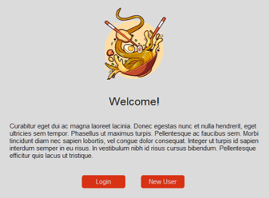
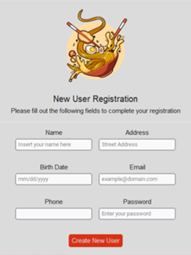
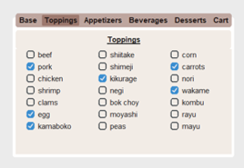

# Ramen Maker

A simple application made with CustomTkinter created as a fun project for practicing Python. It allows the user to create a customized ramen bowl with the ingredients available on the shop, which also offers appetizers, beverages and desserts. 

This project is a work in progress which currently contains the main screens for user registration and login, as well as the screens where the user can select the items they wish to purchase. 

It will later include the payment options and a delivery option which calculates the final price based on the distance to the customer's location.  

## 1. Tools

- **Python:** the main programming language used when developing the application.
- **Tkinter:** the standard Python interface which allows the creation of graphical interfaces
- **CustomTkinter:** a Tkinter extension which provides additional elements which can be customized in various ways.
- **SQLite3:** provides a lightweight disk-based database that doesn’t require a separate server process.
- **Pillow:** a Python library used for manipulating image files.

## 2. Functionalities

- **User Registration:** register new users and store their details in a local database.
- **User Login:** authenticate users using stored credentials.
- **Menu Screens:** allows users to select ingredients for their ramen bowl and other items.

## 3. Screenshots

*Main screen where the user may choose to login or register to the application.* 

*User registration screen which takes the user data and saves it to a database*

*Login screen which checks if the user is already registered in the application's database*

*Tabs through which the user can navigate and select the items to be purchased*

## 4. To-Do List

### 4.1 Existing Features
- Improve the layout and functionality of the menu tabs for a smoother user experience.
- Securely store user passwords using cryptography.
- Refactor code to ensure it follows OOP Guidelines.

### 4.2 New Features
- Develop a method to calculate the total cost of selected items.
- Integrate payment methods for completing transactions.
- Create a method to calculate delivery fees based on the customer’s location.

## 5. References

 - [Course - Modern Tkinter Design With CustomTkinter](https://www.youtube.com/playlist?list=PLfZw_tZWahjxJl81b1S-vYQwHs_9ZT77f)
 - [Course - Python GUI's With TKinter](https://www.youtube.com/playlist?list=PLCC34OHNcOtoC6GglhF3ncJ5rLwQrLGnV)
